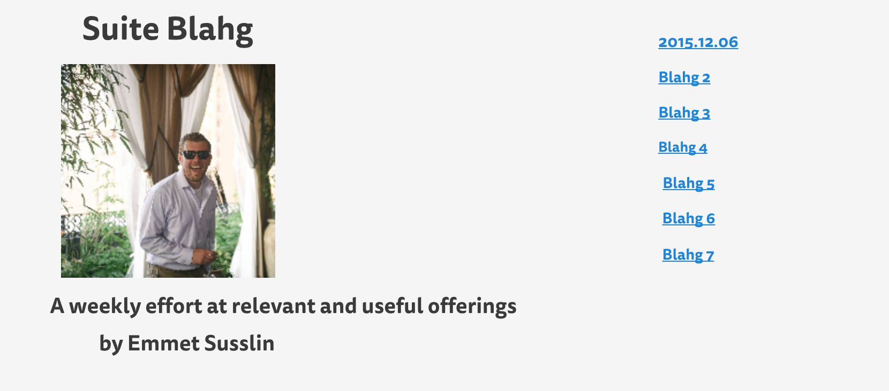
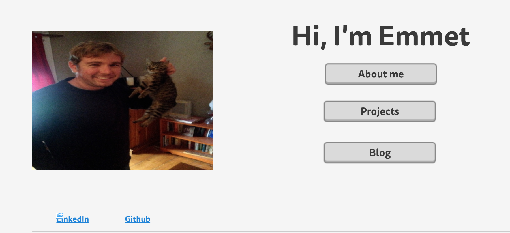

What is a wireframe?

* A general image structure of what you would like the interface of a website to look like - including content, pictures and links.

What are the benefits of wireframing?

Its step one to building a website - what do you want content-wise and what do you want it to look like.

Did you enjoy wireframing your site?

*I actually did yes, i've never been a huge blogger and self-absorbed bloggers who blog endlessly to listen to themselves talk out of self-love and self-importance has always annoyed me greatly ahah.  Since my blog will be central to my progress at DBC and my greater community involvement in and beyond our cohort I named my blog "Suite Blahg" and had fun wireframing my blog site - lets do this.

Did you revise your wireframe or stick with your first idea?

* I stuck with my first idea so far - I'll need to familiarize myself with Mockingbird a bit more and revise as I build the site.

What questions did you ask during this challenge? What resources did you find to help you answer them?

* i had trouble with the relative path at first, but now I'm all set.

Which parts of the challenge did you enjoy and which parts did you find tedious?

* Answering these questions is tedious! (Joking) - no unless I'm missing something these lessons seemed fairly straightforward and creating wireframes is indeed fun.